# Trabalho Prático: Desenvolvimento de Serviços Web Multitecnologia

**Grupo:**
- Diogo Baltazar (230000424) 
- Diogo Pedro (220000891)   
- Pedro Ramiro (230001516)  

**Docente:** Filipe Madeira  
**Unidade Curricular:** Integração de Sistemas  


---

## Descrição  
Este projecto consiste no desenvolvimento de uma **aplicação cliente-servidor distribuída**, baseada no trabalho individual previamente desenvolvido. A arquitectura implementa a integração de diversas tecnologias de **serviços web multitecnologia** (REST, SOAP, GraphQL, gRPC, WebSockets), suportando também **mensageria assíncrona** e **autenticação com JWT/OAuth2**, com todos os serviços orquestrados através de **Docker** e **docker-compose**.
 

### Nota Adicional:
Antes de configurar os serviços no servidor fornecido pelo professor, todo o código foi desenvolvido no **VSCode** e testado localmente. Apenas após a realização destes testes é que o código foi transferido para os servidores e configurado.

### Tecnologias Utilizadas:
- **REST** – Flask + JSON Schema + JSONPath  
- **SOAP** – Spyne + Validação com XSD  
- **GraphQL** – Strawberry + FastAPI  
- **gRPC** – Python gRPC (Protobuf)  
- **WebSockets** – FastAPI WebSocket  
- **Mensageria** – RabbitMQ  
- **Autenticação** – OAuth 2.0 + JWT + FastAPI Users  
- **Base de Dados** – MongoDB (NoSQL)  
- **Orquestração** – Docker + docker-compose  
- **Persistência de Dados** – JSON (com capacidade de conversão para XML) 

---
---

## 🧱 Arquitectura Distribuída

- **Servidor 1**: SOAP + REST  
- **Servidor 2**: GraphQL + gRPC + WebSockets  
- **Servidor 3**: MongoDB + Autenticação + RabbitMQ  
- A comunicação entre serviços é feita via **HTTP, gRPC e AMQP (RabbitMQ)**  
- Os dados são partilhados entre serviços através de **volumes Docker**

---

## 🐳 Execução com Docker

Para iniciar os serviços:

```bash
docker-compose up --build
```

### Serviços definidos no `docker-compose.yml`:

- `rest_service` – API REST com validação por JSON Schema  
- `soap_service` – API SOAP com validação por XSD  
- `graphql_service` – GraphQL com Strawberry  
- `grpc_service` – Serviço gRPC com Protobuf  
- `websocket_service` – Notificações em tempo real por WebSocket  
- `auth_service` – Autenticação com OAuth2 / JWT  
- `rabbitmq` – Broker de mensagens  
- `mongodb` – Base de dados NoSQL  
- `client` – Cliente Python (Web/CLI)

---

## Requisitos  

Antes de começar, certifique-se de que o seu ambiente atende aos seguintes requisitos:  
- **Python:** Certifique-se de que o Python está instalado. Verifique a versão com:
  ```bash
  python --version
  ```
- **Pip:** Certifique-se de que o Pip está instalado. Verifique a versão com:
  ```bash
  pip --version
  ```  

---

## Instalação  

### 1. Clonar o Repositório  
Para obter o código fonte, execute os seguintes comandos:  
```bash
git clone <URL_DO_REPOSITORIO>
cd <nome-do-repositorio>
```

### 2. Instalar Dependências  
Instale as dependências do projeto tanto no cliente como no servidor.  
```bash
pip install -r requirements.txt
```

---

## Configuração e Execução  

### Iniciar no Servidor o serviço de SOAP:
```bash
python3 var/www/Dmgp/soap/soap_service.py
```

### Iniciar no Servidor o serviço de REST:
```bash
python3 var/www/Dmgp/rest/rest_service.py
```

### Iniciar no Servidor o serviço de GraphQL:
```bash
python3 var/www/Dmgp/graphql/graphql_service.py
```

### Iniciar no Servidor o serviço de gRPC:
```bash
python3 var/www/Dmgp/grpc/grpc_service.py
```

---

## Exemplo de Chamadas (Postman)  

### SOAP  
#### Exemplo de Request (XML)
```xml
<soapenv:Envelope xmlns:soapenv="http://schemas.xmlsoap.org/soap/envelope/" xmlns:ser="http://servicos.exemplo/">
   <soapenv:Header/>
   <soapenv:Body>
      <ser:getLivro>
         <id>2</id>
      </ser:getLivro>
   </soapenv:Body>
</soapenv:Envelope>
```

#### Exemplo de Response  
```xml
<soapenv:Envelope xmlns:soapenv="http://schemas.xmlsoap.org/soap/envelope/">
   <soapenv:Body>
      <getLivroResponse>
         <livro>
            <id>2</id>
            <titulo>1984</titulo>
            <descricao>Um clássico de George Orwell sobre um futuro distópico.</descricao>
            <estado>pendente</estado>
         </livro>
      </getLivroResponse>
   </soapenv:Body>
</soapenv:Envelope>
```

---
### REST
#### Exemplo de Request: GET /livros/2
```http
GET http://192.168.246.33:55556/livros/2 HTTP/1.1
Host: 192.168.246.33
```

#### Exemplo de Response  
```json
[
  {
    "id": 2,
    "titulo": "1984",
    "descricao": "Um clássico de George Orwell sobre um futuro distópico.",
    "estado": "pendente"
  }
]
```

---

### GraphQL  
#### Exemplo de Request Body  
```json
{
  "query": "query { livro(id: 2) { titulo descricao estado } }"
}
```

#### Exemplo de Response  
```json
{
  "data": {
    "livro": {
      "titulo": "1984",
      "descricao": "Um clássico de George Orwell sobre um futuro distópico.",
      "estado": "pendente"
    }
  }
}
```

---

### gRPC  
#### Exemplo de Request 
```python
import grpc
from livros_pb2 import LivroRequest
from livros_pb2_grpc import LivrosStub

# Configuração do canal gRPC
channel = grpc.insecure_channel('192.168.246.33:55558')
client = LivrosStub(channel)

# Enviar a requisição
response = client.GetLivro(LivroRequest(id=2))

# Exibir a resposta
print(response)
```

#### Exemplo de Response  
```json
{
  "id": 2,
  "titulo": "1984",
  "descricao": "Um clássico de George Orwell sobre um futuro distópico.",
  "estado": "pendente"
}
```

---

## Prints dos Passos de Configuração  

Abaixo estão os prints capturados durante o processo de configuração do servidor:

### 1. Atualizar os repositórios e instalar o Apache  
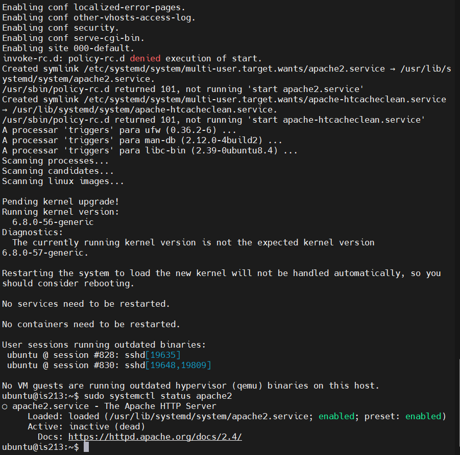

### 2. Verificar se o serviço Apache está ativo  
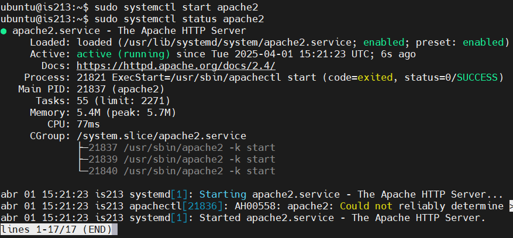  

### 3. Garantir que o serviço Apache inicia automaticamente  
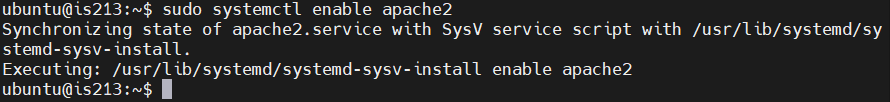  

### 4. Testar o servidor Apache  
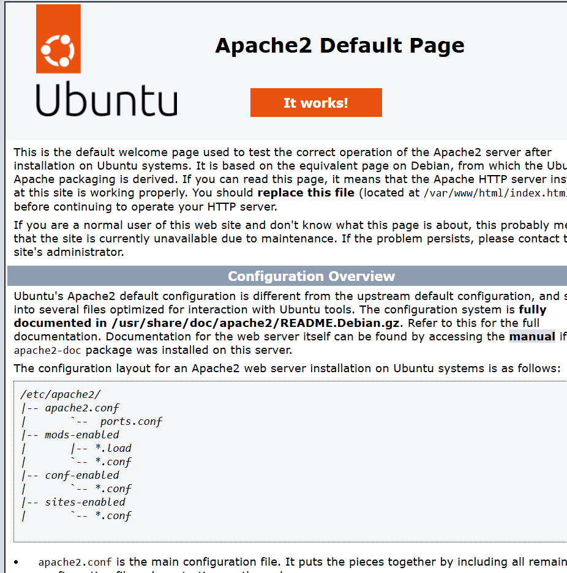  

### 5. Apagar a página padrão do Apache  
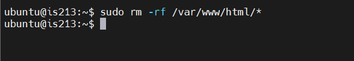  

### 6. Criar um ficheiro `index.html` de teste  
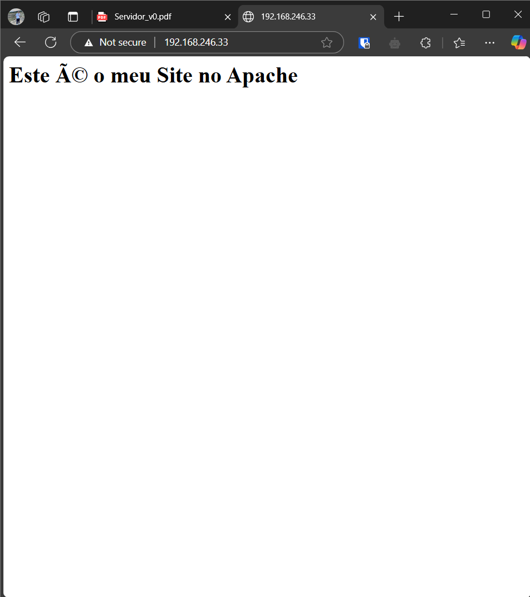  

### 7. Configurar um Virtual Host  
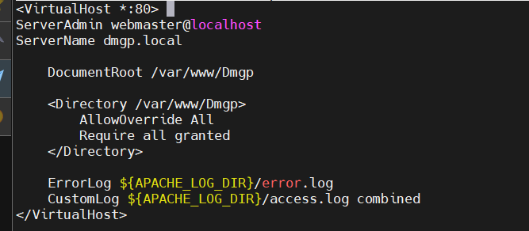  
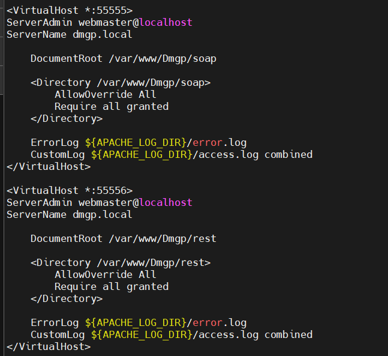
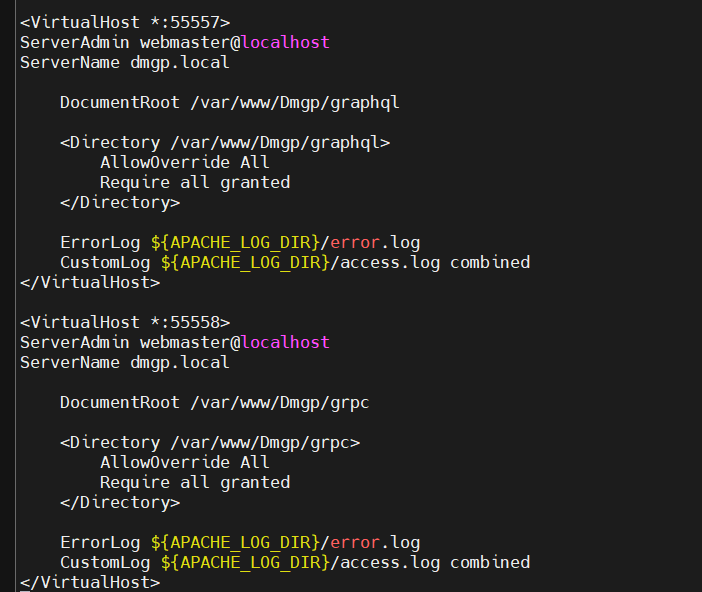
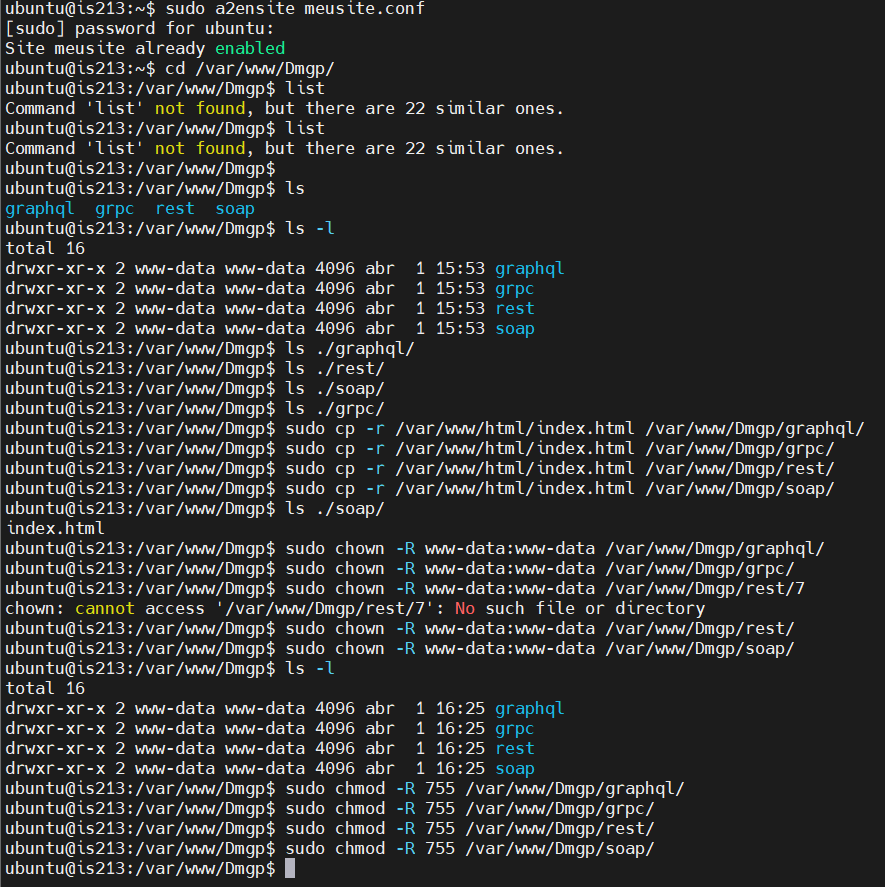
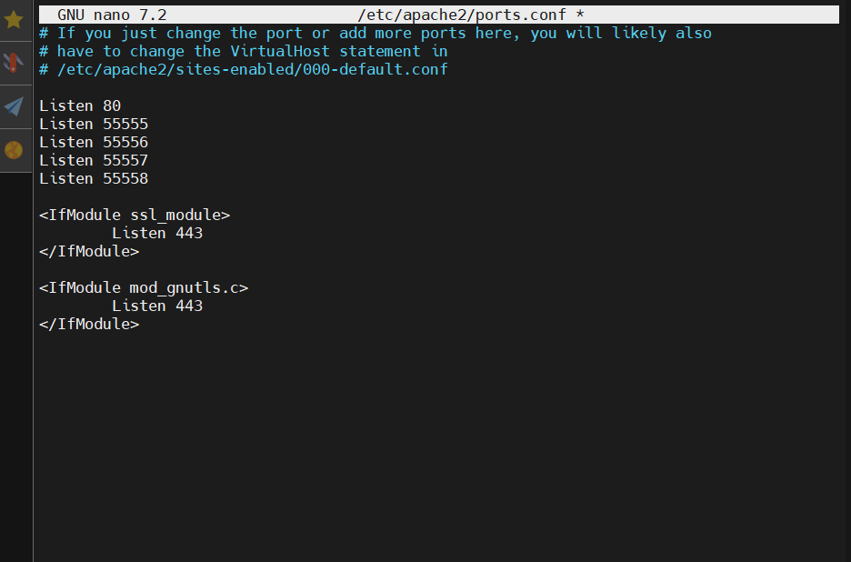

### 8. Associar o domínio personalizado ao IP  
#### No Servidor
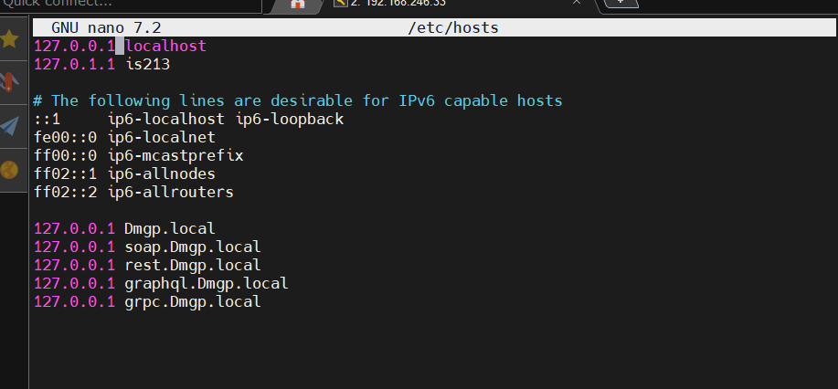  
#### No Windows
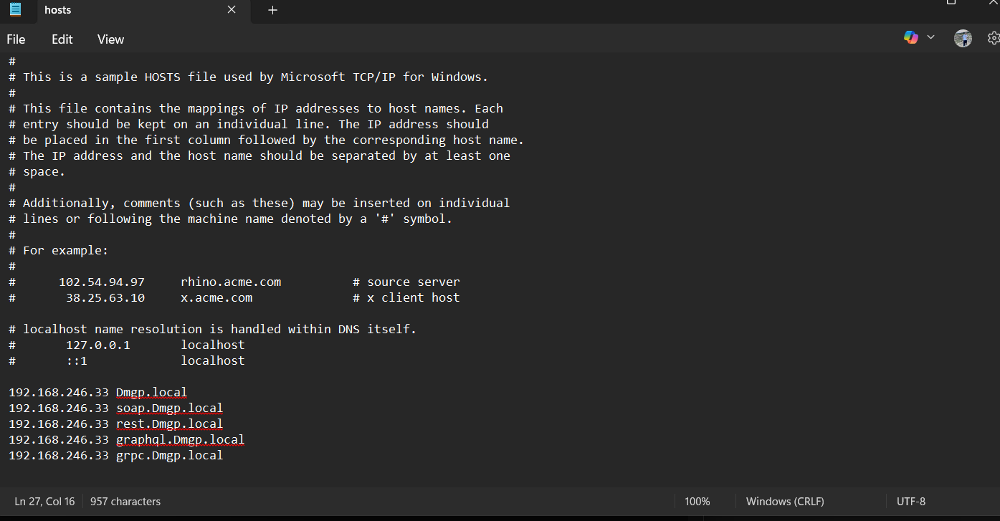  

### 9. Testar o domínio personalizado  
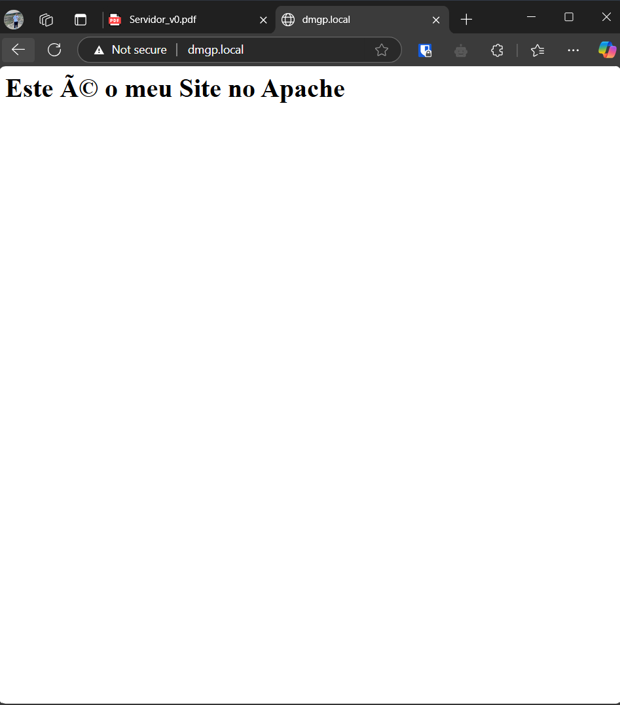  

---

## Estrutura do Projeto  

Abaixo está a estrutura do projeto:

```
WebMultitec_IS
│
├── cliente
│   ├── app.py
│   ├── Dockerfile
│   └── requests
│       ├── graphql_client.py
│       ├── grpc_client.py
│       ├── rest_client.py
│       └── soap_client.py
│
├── documentacao
│   ├── requirements.txt
│   └── prints_configServer
│       ├── Passo1.png
│       ├── Passo2.png
│       ├── Passo3.png
│       ├── Passo4.png
│       ├── Passo5.png
│       ├── Passo6.png
│       ├── Passo7_1&10.png
│       ├── Passo7_2&10.png
│       ├── Passo7_3&10.png
│       ├── Passo7_4&10.png
│       ├── Passo7_5&10.png
│       ├── Passo8_1.png
│       ├── Passo8_2.png
│       └── Passo9.png
│
├── servidor
│    │
│    ├── graphql
│    │   ├── Dockerfile
│    │   └── graphql_service.py
│    │
│    ├── grpc
│    │   ├── Dockerfile
│    │   ├── grpc_service.py
│    │   ├── livros.proto
│    │   ├── livros_pb2.py
│    │   └── livros_pb2_grpc.py
│    │
│    ├── rest
│    │   ├── Dockerfile
│    │   └── rest_service.py
│    │
│    ├── soap
│    │    ├── Dockerfile
│    │    └── soap_service.py
│    │
│    ├──websocket     
│        ├── Dockerfile
│        └── websocket_server.py
│ 
├──docker-compose.yml

```